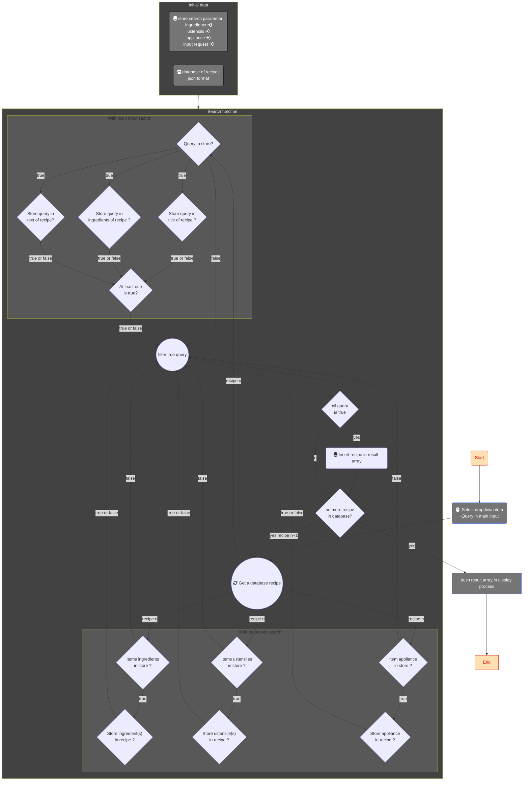

## OC-Project_7: Develop a search algorithm in JavaScript.

**Project name:** "Les Petits Plats".
**Project objective:** Create a recipe website like Marmiton or 750g..
**Github page:**

----------
### Release date and code advance
|Date|Comments  |
|--|--|
|``29/05/2024``|Creation of the boolean filter search method flowchart|
| ``08/04/2024`` |Restarting the project using TailWind instead of Bootstrap|
|``29/03/2024``|Start of main page integration with Bootstrap.|

### Search algorithm

