## OC-Project_7: Develop a search algorithm in JavaScript.

**Project name:** "Les Petits Plats".
**Project objective:** Create a recipe website like Marmiton or 750g..
**Github page:**

----------
### Release date and code advance
|Date|Comments  |
|--|--|
|``06/06/2024``|Documentation updated with diagram of algorithm data standardization version|
|``08/04/2024``|Redémarrage du projet en utilisant TailWind au lieu de Bootstrap.|
|``29/03/2024``|Début d'integration de la page pricipale avec Bootstrap.|

### Search algorithm

```mermaid
flowchart TB
    subgraph data["Initial data"]
        tags("fa:fa-database store search parameter:
            ingredients fa:fa-arrow-right-to-bracket
            ustensils fa:fa-arrow-right-to-bracket
            appliance fa:fa-arrow-right-to-bracket
            input request fa:fa-arrow-right-to-bracket")
    end
    subgraph normData["Standardized data"]
            sortedData("fa:fa-database recipes sorted by ID
            fa:fa-database ingredients sorted by ID
            fa:fa-database recipes sorted by ingrédients
            fa:fa-database recipes sorted by appliances
            fa:fa-database recipes sorted by ustensils")
    end
    subgraph search["Search function"]
    direction LR
        resultDd("result data array
                    of dropdown")
        ifthree{Query in store
                    > 3 character?}
        subgraph testDropdown["With dropdown search"]
        direction TB
        getDd["`Get category of
                search parameter data
                without **input request**`"]
        nextDd["Get next category"]
        
        ifDd_empt{is category
                empty?}
        ifDd_ing{is category
                    = ingredients?}--true-->actDd_ing["Get ID recipe foreach ingredients
                                                        of recipes sorted by ingredients
                                                        and store them in result array"]-->ifDd_ust
        ifDd_ust{is category
                    = ustensils?}--true-->actDd_ust["Get ID recipe foreach ustensils
                                                        of recipes sorted by ustensils
                                                        and store them in result array"]-->ifDd_app
        ifDd_app{is category
                    = appliances?}--true-->actDd_app["Get ID recipe for appliance
                                                        of recipes sorted by ingredients
                                                        and store them in result array"]-->ifDd_last
        ifDd_last{is last
                    category?}

        end
        subgraph testInput["Search ingredients with main input search"]
        direction TB
        getInp["Get each ingredient of recipe
                    sorted by ingredients"]
        getInp_next[Get next ingredient]
        ifInp_ing{is input request
                    in ingredient}--true-->actInp_ing["Get ID recipes of recipe
                                                        sorted by ingredient and
                                                        store them in result array   "]-->ifInp_last
        ifInp_last{is last
                    ingredient?}
        end
        subgraph testInputTitle["Search title and terms in the description"]
        direction TB
        getTtl["Get each recipe of
            recipes sorted by ID"]
        getTtl_next[Get next recipe]
        ifTtl_ttl{is input request
                    in title of recipe?}--true-->actTtl_ttl["Get ID recipes of recipe
                                                        sorted by ingredient and
                                                        store them in result array   "]-->ifTtl_desc
        ifTtl_desc{is input request
                    in description 
                    of recipe?}--true-->actTtl_desc["Get ID recipes of recipe
                                                        sorted by ingredient and
                                                        store them in result array   "]-->ifTtl_last
        ifTtl_last{is last
                    recipe?}
        end
    end
    normData-.->search
    data -.-> search
    start("Start") --> action("Select dropdown item
                                with / without
                                Query in main input")
    %%DropDown search flowchart
    action-->getDd-- category -->ifDd_empt--false-->ifDd_ing--false-->ifDd_ust--false-->ifDd_app--false-->ifDd_last
    ifDd_empt--true-->nextDd-- next category -->ifDd_empt
    ifDd_last--false-->nextDd
    ifDd_last-- true ---resultDd("result data array
                                    of dropdown") -->ifthree--true-->getInp
    ifthree--false-->display
    %%Search ingredient main input
    getInp--ingredient-->ifInp_ing--false-->ifInp_last--false-->getInp_next-- next ingredient -->ifInp_ing
    ifInp_last--true-->getTtl

    %%Search title and in description
    getTtl--recipe-->ifTtl_ttl--false-->ifTtl_desc--false-->ifTtl_last--true-->display["push result array in display process"]-->finish[End]
    ifTtl_last--false-->getTtl_next-- next recipe -->ifTtl_ttl

   



    style tags fill:#757575,color:#FFFFFF,stroke:#000000
    style data fill:#424242,color:#FFFFFF
    style search fill:#424242,color:#FFFFFF
    style testDropdown stroke:#F404040,fill:#585858,color:#303030
    style testInput stroke:#F404040,fill:#585858,color:#303030
    style start stroke:#D50000,fill:#FFE0B2,color:#D50000
    style finish stroke:#D50000,fill:#FFE0B2,color:#D50000
    style action fill:#757575,stroke:#2962FF,color:#FFFFFF
    style display fill:#757575,stroke:#2962FF,color:#FFFFFF
```

